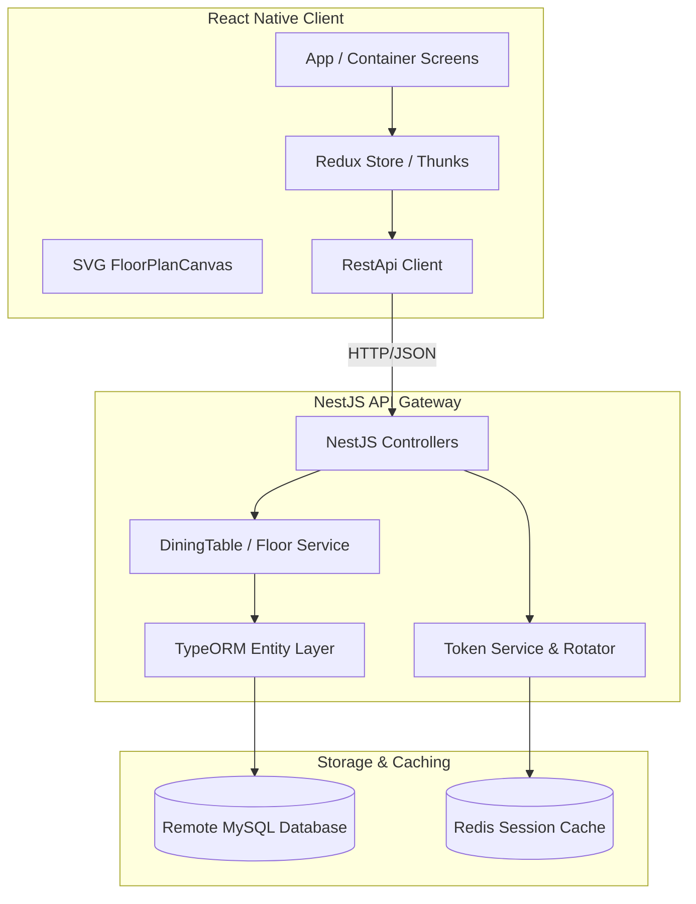

# RTMS (Restaurant Table Management System) - Reference Manual

This document provides a comprehensive overview of the RTMS codebase (both frontend and backend), detailed database structures, core implementation details (including the responsive SVG canvas layout math and Android crash fixes), and a prioritized task list for subsequent development.

---

## 1. Project Overview & Architecture

RTMS is a real-time table management and booking application designed to handle high-concurrency table status queries, interactive floor views, and reservation flows for multi-floor restaurants.

### System Architecture Diagram


### Tech Stack Details
* **Backend**:
  - NestJS Framework (TypeScript)
  - TypeORM with MySQL database
  - Redis for refresh-token family session tracking (with auto-fallback to an in-memory `Map` when Redis is offline)
  - JWT Authentication with rotating refresh tokens
* **Frontend**:
  - React Native (Bare Workflow)
  - Redux (Actions, Operations Thunks, and Reducers pattern)
  - `react-native-svg` for rendering interactive floor layouts dynamically

---

## 2. Rare Gulberg Data Specification

**Rare Gulberg** is the primary test branch configured in the database:
* **Branch ID**: `00000000-0000-7000-8000-000000000030`
* **Address**: MM Alam Road, Gulberg III, Lahore
* **Company ID**: `00000000-0000-7000-8000-000000000010`

### Active Floors & Table Counts
* **Ground Floor** (`00000000-0000-7000-8000-000000000040`): 6 tables (T-1 to T-6)
* **2nd Floor** (`00000000-0000-7000-8000-000000000041`): 7 tables (T-7 to T-13)
* **basement** (`019fb823-c27c-7546-ac9e-f0e5046d91a6`): 1 table
* **QA Test Floor** (`01a014a0-9d41-72a5-87d9-ce28fcb38d6a`): 2 tables
* **Basement (Legacy)** (`019fd18d-8a5a-7ad7-82bd-7d645ac1868f`): 3 tables
* **2nd Floor (Legacy)** (`019fd0b2-58ff-761e-a487-3db715802f03`): 2 tables

---

## 3. Database Schema Overview

The database runs on MySQL at host `43.164.74.2:9898`. Key tables are as follows:

| Table Name | Description | Key Fields |
| :--- | :--- | :--- |
| `branch` | Restaurant branch locations | `id`, `name_i18n`, `address_i18n`, `restaurant_id`, `company_id` |
| `floor` | Floor levels inside a branch | `id`, `branch_id`, `name_i18n`, `sort_order`, `canvas_meta` (JSON) |
| `dining_table` | Dining tables on a floor | `id`, `floor_id`, `branch_id`, `label`, `shape`, `pos_x`, `pos_y`, `width`, `height`, `rotation` |
| `booking` | Table reservations | `id`, `branch_id`, `status`, `starts_at`, `ends_at` |
| `table_type` | Structural table seating definitions | `id`, `shape`, `capacity_min`, `capacity_max` |

---

## 4. Core Implementation & Math Calculations

### 4.1 Responsive Canvas Scaling & Android Crash Fix

#### The Problem: Large Bitmap Allocation Crash
The database stores canvas coordinates in large ranges (e.g., coordinates scaling up to `3000px`). When `react-native-svg` rendered these on physical Android devices, it allocated a rasterized bitmap matching the raw viewBox size (e.g., $3000 \times 3000 \times 4\text{ bytes} \approx 36\text{ MB}$ or larger, up to 252MB for complex ones). This instantly threw `java.lang.RuntimeException: Canvas: trying to draw too large bitmap` and crashed the app.

#### The Math Solution:
We scale down all coordinates using a scaling factor, constraining the maximum viewBox dimension to **800px**.

$$\text{scaleFactor} = \min\left(1, \frac{\text{MAX\_VIEWBOX\_DIM}}{\max(\text{rawW}, \text{rawH})}\right)$$

Every element coordinate $(x, y)$ and dimension $(W, H)$ is scaled dynamically:

$$x_{\text{scaled}} = x \times \text{scaleFactor}$$
$$y_{\text{scaled}} = y \times \text{scaleFactor}$$
$$W_{\text{scaled}} = W \times \text{scaleFactor}$$
$$H_{\text{scaled}} = H \times \text{scaleFactor}$$

This keeps the SVG viewBox small enough to avoid memory crashes on physical Android hardware while preserving the layout's aspect ratio perfectly.

#### Element-Based Dynamic Cropping & Auto-Zoom:
To prevent layouts with sparse elements (like the Basement containing only a single table, sofas, and walls) from rendering as a tiny portion in a corner, boundaries are computed dynamically based strictly on active layout elements.
* **Bounds Calculation**: Evaluates the minimum and maximum coordinates of all active dining tables and structural decor objects (`structuralObjects`), expanding them symmetrically to enforce a minimum scale bounding box (minimum `280px` width and `200px` height) to prevent excessive over-zooming.
* **Auto-Fit**: Fills the entire blue boundary canvas container cleanly while keeping all layout boundaries correctly aligned, regardless of the raw database canvas size.
* **Proportional Square Styling**: The canvas container on mobile screens is designed as a perfect equal square (`width` matching `height` 1-to-1).
* **Borderless View Display**: Both the restaurant details screen and the full-screen view render with borderless square containers (`styles.borderlessContainer`), completely removing any outer blue boundaries.
* **Parent ScrollView Scroll-Lock**: Implements a dynamic scroll-lock (`parentScrollEnabled` state in `RestaurantDetailsScreen.js` toggled via `onTouchStart`/`onTouchEnd` listeners). When the user touches anywhere within the canvas boundary, the parent ScrollView's scrolling is instantly disabled. This allows finger-pinch gestures to execute cleanly and reliably, with 0 interference from vertical page scrolling.
* **Built-in Native Gestures (Zoom & Scroll/Pan)**: Implements high-performance native-driver scale and translation gestures using built-in React Native `PanResponder` and `Animated` libraries to prevent package resolution errors:
  - **Pinch-to-Zoom**: Uses absolute multi-touch coordinates (`touches[0].pageX` / `touches[0].pageY`) to compute dynamic zoom scales, clamping the value strictly between `1.0x` and `5.0x` on every gesture frame.
  - **Default Zoom-in Scale**: On opening the full-screen view (`scrollable = true`), the canvas loads pre-zoomed to a default offset point of `1.3x` to provide immediate clarity, and resets back to `1.3x` when re-centered.
  - **Drag-to-Scroll/Pan**: Tracks single-finger drags. On the details page (`scrollable = false`), panning translations are disabled entirely. This keeps the scaled floor plan perfectly centered inside the container boundary without any vertical/horizontal drifting when zooming. Panning is fully enabled on the full-screen view (`scrollable = true`).
  - **Full-Screen Height Expansion**: On the full-screen view, the canvas dynamically measures and matches the entire available height of the parent container instead of locking to a square width. This expands the layout to cover the maximum vertical screen space of the device.
  - **Transform Ordering**: Scale is applied before translations (`{ scale }, { translateX }, { translateY }`). This prevents scaling from multiplying panned offsets, keeping the layout origin stable.
* **Spring-Animated Reset Overlay**: Adds a floating `⟲ Reset` button overlay (visible on full screen) that uses built-in spring physics (`friction: 6`) to snap the canvas position and zoom level smoothly back to its default starting offset (`1.3x`).

### 4.2 Multi-Cache Dictionary System
To ensure near-instant navigation and booking flows, a dictionary-based cache strategy is implemented in the Redux store:
* **Restaurant Details Cache**: Located at `state.restaurant.detailsCache`. It maps `restaurantId -> detailsData`. 
* **Table Occupancy Cache**: Located at `state.tables.tablesCache`. It maps `${branchId}_${date}_${timeSlot} -> { floors, tablesByFloor, selectedFloorId }`.
* **Booking Policy & Availability Cache**: Located at `state.booking.policyCache` (mapping `branchId -> bookingPolicy`) and `state.booking.availabilityCache` (mapping `${branchId}_${date}_${partySize} -> slots`).

When navigation triggers a load (e.g. tapping a restaurant, choosing a date/time, or opening the booking picker), the app checks if the key exists in the cache dictionary. If yes, it loads the screen or layout **instantly with 0 delay** (suppressing the loading spinner) and silently performs a background network request to revalidate and update the state.

---

## 5. Prioritized Tasks & Backlog Issues

### [Task 1] Real-time Booking Sync via WebSockets [HIGH PRIORITY]
* **Problem**: Currently, table occupancy is only fetched via polling HTTP requests on date/time selection.
* **Goal**: Implement socket connections using `socket.io-client` in React Native and `@nestjs/websockets` on the backend to push instant occupancy updates to the canvas when a new booking is created or updated.

### [Task 2] Interactive Table Grouping (Split / Join Layouts) [MEDIUM PRIORITY]
* **Problem**: Combined tables are treated as separate shapes without visual indicators of linkage.
* **Goal**: When `joinTables` is toggled true in Redux, draw connecting dotted borders between tables having `isCombinable: true` and situated near each other, allowing users to tap and select them as a single reservation block.

### [Task 3] Custom Floor Layout Builder [MEDIUM PRIORITY]
* **Problem**: Setting up new layouts currently requires writing raw JSON to `canvas_meta` manually.
* **Goal**: Build an administration canvas editor screen where users can drag, rotate, and place tables, sofas, and structural walls, sending the updated layouts back to `/portal/floors/:id` patch endpoint.

---

## 6. How to Run & Verify

### Backend (rtbs-backend-js)
* **Start Dev Server**: `npm run start:dev`
* **Note**: If Redis is not running locally, the NestJS server will log a warning and fall back to in-memory caching. You do **not** need a running Redis container to develop locally.

### Frontend (Rtms Client)
* **USB Port Forwarding for Physical Devices**:
  ```bash
  adb reverse tcp:3000 tcp:3000
  ```
  *(Required so `http://localhost:3000` from the connected USB device maps back to the PC)*
* **Build & Run**: `npx react-native run-android`
